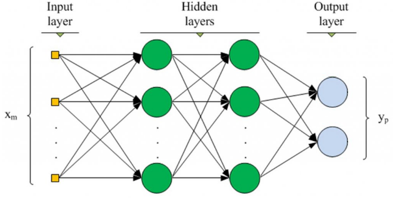

## ELEC4630
**ELEC4630 Computer Vision and Image Processing**

Here are a few Colab notebooks to get you started with deep learning.  We have decided to use Google [Colab](https://colab.research.google.com) notebooks because you can access them from anywhere and can run your code on a cloud-based GPU.  

**How to run a Colab notebook**

1. In GitHub, open a notebook with ipynb extension
2. You should see a "Open in Colab" button
3. Click this and the notebook will open in Colab
4. You can use Runtime/Run all to run all the code, or you can execute one codeblock at a time.

**Let's get started on some exercises**
1. [Introduction to Google Colab](https://colab.research.google.com/github/lovellbrian/ELEC4630/blob/master/Exercises/Welcome_To_Colaboratory.ipynb)
2. [Access a GPU in the cloud and perform a speed test](https://colab.research.google.com/github/lovellbrian/ELEC4630/blob/master/Exercises/TensorFlow_with_GPU.ipynb)
3. [Introduction to Python, Numpy, and MatLibPlot](https://colab.research.google.com/github/lovellbrian/ELEC4630/blob/master/Exercises/colab_tutorial.ipynb)
4. [Train a CNN on the MNIST dataset](https://colab.research.google.com/github/lovellbrian/ELEC4630/blob/master/Exercises/beginner.ipynb)

